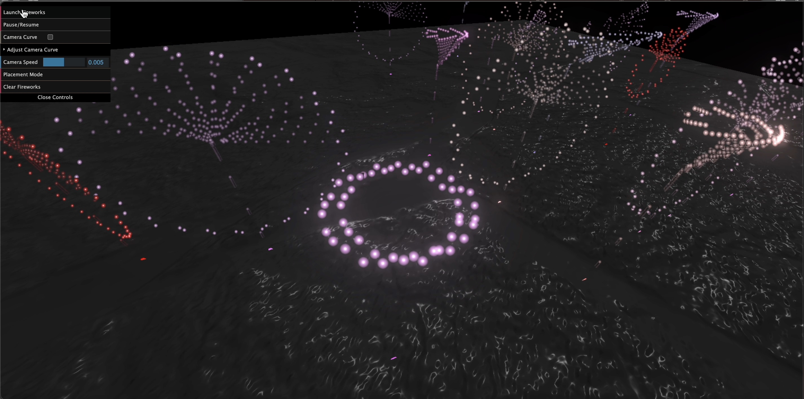

# CSCI1230 Final Project: Firework!

### Team Members
Caroline Zhang (czhan157) \
Amber Dong (ydong34)



## Project Overview
For our final project, we created a fireworks simulation using Three.js. Users can customize fireworks, selecting from different colors, firework types, explosion speeds, and the fireworks launch sequence. They can also choose between viewing the fireworks using orbital controls, or using our GUI to create a custom Bezier Curve camera path.

## Implementation Details

### Particle Simulation
We created particles and streaks to model the movement of the fireworks. Each particle is modeled as a square with a circular mask over it. This mask contains the user-designated firework color. We also perform a gradient calculation to make the edges of the mask fade. 

Each particle is also initialized with a corresponding {x,y,z} velocity and an {x,y,z} position. These are concatenated to create a **velocities** and **positions** array. After a particle has traveled upward, its position indices are updated by its velocities and trigonometric operations (which depend on the firework type). 

The positions of the firework particles are stored in a buffer array. This buffer is used to calculate where the streak particles should go, given the current location of a particle. A single streak particle has the same color and gradient as a firework particle; however the streak particles lose size and opacity over time. Information about the streak velocities and positions is also stored in two separate arrays. 

### Physics Based Simulation
 When a firework is set to launch, the particles travel upwards for the first 20% of the designated time, before exploding. The "scattering" of the particles upon launching is calculated by dividing 360 by the number of total particles and using that number as the number of degrees the particles should go away from one another. This allows for particles to form circular and elliptical outlines. To account for the effect of gravity and drag, the particle velocities and y-values of the particles (and their streaks) are gradually decremented after a certain time point. 

### Bezier Camer Curves
Users are able to provide four {x,y,z} coordinate points to the GUI. These points are used to calculate a Bezier curve path for the camera that will be animated once the fireworks are launched. 

### Bloom Post-Processing
We applied bloom to make our fireworks emit more light as they explode. 

## Installation Instructions

### Prerequisites
- Install **Node.js** and **npm** before proceeding.

### Steps
1. **Install Three.js**
   ```bash
   npm install --save three
   ```

2. **Install Vite**
   ```bash
   npm install --save-dev vite
   ```

3. **Install GUI**
   ```bash
   npm install three-dat.gui
   ```

## Running the Project
To start the development server:
```bash
npx vite
```

## Production Build
To create a production-ready build:
```bash
npx vite build
```


## Code Structure

**src/utils/fireworktrails.js** contains the logic for initializing and updating the firework streaks, as well as creating their texture and material. 

**src/utiles/fireworkparticles** contains the logic for initializing and updating the firework particles,as well as creating their texture and material. 

**src/utils/visualeffects** contains the logic for applying bloom to the scene. 

**src/fireworks.js** contains the logic for creating a single firework.  

**src/terrain.js** loads in a texture file used for the terrain of our scene.

**src/main.js** contains the logic for rendering and animating the whole scene, the GUI, camera trajectories, and making calls to createFirework. 
